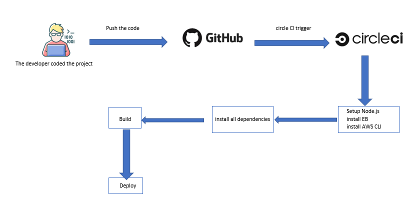

# Pipeline process

* The developer codes the project and push it.
* Create circleCI account and link you github with it.
* circleCI will triger the workflow every time you push the code.
* circleCI will install requirements.
* circleCI will build the app.
* after successful build stage, the deploy stage will start.